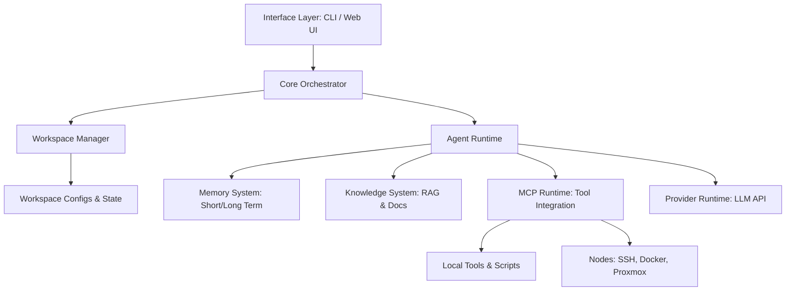

# Architecture Overview

Novara OS is structured into distinct, decoupled layers, ensuring flexibility across LLM providers and infrastructure backends.

## Layer Definitions

1.  **Interface Layer**: The entry point. Handles CLI parsing, interactive sessions, and web UI rendering.
2.  **Core Orchestrator**: Manages session state, coordinates agent loops, and enforces user approval checkpoints.
3.  **Workspace Manager**: Resolves target workspace directories, configs, environment variables, and active profiles.
4.  **Agent Runtime**: The execution loop responsible for prompting the LLM, parsing tool calls, and maintaining the agent's state machine.
5.  **Subsystems**:
    *   **Memory**: Manages session history and semantic recall.
    *   **Knowledge**: Searches local repositories and documentation index.
    *   **MCP Runtime**: Implements Model Context Protocol to bind tools, resources, and prompts dynamically.
    *   **Provider Runtime**: Bridges the core to LLMs (Gemini, Claude, OpenAI, etc.).

---

## Core Orchestrator (Orchestration Engine)

The Core Orchestrator is the central control plane of Novara OS. It coordinates the data flow between all subsystems, manages the task state machine, and acts as the gatekeeper for user safety.

### Main Functions

1.  **Session & State Lifecycle**:
    *   Initializes the active workspace environment.
    *   Loads workspace configuration (`workspace.yaml`) and maps environment credentials (`secrets.env`).
    *   Instantiates required local/remote MCP Servers.

2.  **Dynamic Context Assembly**:
    *   Compiles the final system and user prompts before sending them to the `Provider Runtime`.
    *   Resolves language preferences from settings: Injects instructions to prompt the model to communicate using the specified primary language (default: **Bahasa Indonesia**), falling back to the secondary language (**English**) if necessary.
    *   Selectively merges recent history (Memory), relevant document chunks (Knowledge), active tool schemas (MCP), and node inventory details.

3.  **Human-in-the-Loop Gatekeeping**:
    *   Intercepts tool execution payloads from the `Agent Runtime`.
    *   Applies security filters and routing rules (e.g. prompt user confirmation in CLI for write commands).
    *   Feeds execution outcomes back to the execution engine.

